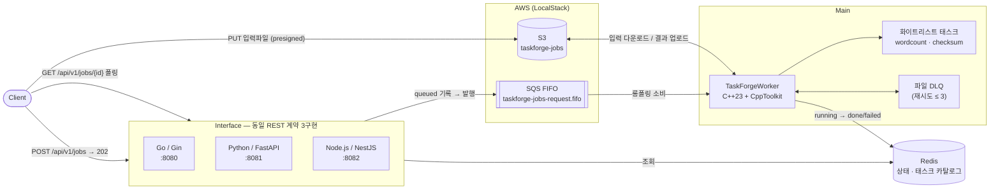
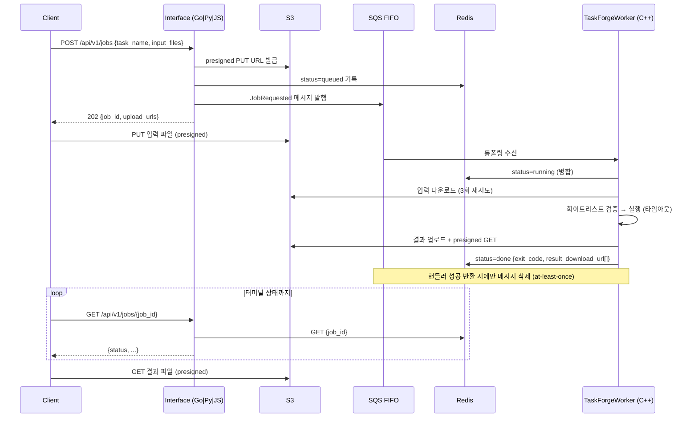

# yirang-taskforge

Request-driven job orchestration platform — 요청을 큐에 넣고, 분산 워커에서 화이트리스트 실행파일을 실행하고, 완료를 추적합니다.

동일한 REST API 계약을 **3개 언어(Go/Python/TypeScript)** 로 구현한 포트폴리오 프로젝트입니다. 코어 워커는 **C++23 + [CppToolkit](https://github.com/ngee044/CppToolkit)** 으로 작성되었습니다.

## 아키텍처



### 작업 처리 시퀀스



실패 경로: 처리 실패 → 파일 DLQ에 try_count 기록 → 3회까지 요청 큐 재발행 → 소진 시 `failed` 확정. 스키마 위반 메시지는 재시도 없이 폐기됩니다.

## 구성 요소

| 경로 | 스택 | 역할 |
|---|---|---|
| `Main/` | C++23, CppToolkit(서브모듈), aws-sdk-cpp, boost.process | SQS 소비 → 화이트리스트 태스크 실행 → S3/Redis 갱신 |
| `Interface/golang/` | Go 1.22+, Gin, aws-sdk-go-v2, go-redis | REST API (:8080) |
| `Interface/python/` | Python 3.11+, FastAPI, boto3, redis-py | REST API (:8081) |
| `Interface/js/` | Node.js 20+, NestJS, TS strict, @aws-sdk v3, ioredis | REST API (:8082) |
| `docker/` | Ubuntu 24.04, LocalStack, Redis 7 | 전체 스택 Compose + E2E |
| `docs/` | ISO 29148/42010/29119-3 | SRS·SAD·STP·RTM·API 계약·컨벤션 |

## 빠른 시작 (Docker)

전제: Docker Desktop (또는 docker + compose v2)

```bash
git clone --recursive https://github.com/ngee044/yirang-taskforge.git
cd yirang-taskforge/docker

# 전체 스택 빌드 + 기동 (워커는 컨테이너 안에서 vcpkg로 빌드 — 최초 수십 분 소요)
docker compose up -d --build

# E2E 검증 (3개 API 각각: 등록→업로드→폴링→결과 검증 + 실패 케이스)
./scripts/e2e_test.sh
```

## API 사용법

세 인터페이스는 포트만 다르고 계약이 동일합니다 (`8080`=Go, `8081`=Python, `8082`=NestJS). 전체 계약은 [`docs/API.md`](docs/API.md) 참조.

```bash
# 1. 실행 가능한 태스크 목록
curl -s localhost:8080/api/v1/tasks | jq

# 2. 작업 등록 → job_id + 업로드 URL 수령
RESP=$(curl -s -X POST localhost:8080/api/v1/jobs \
  -H 'Content-Type: application/json' \
  -d '{"task_name":"wordcount","input_files":[{"filename":"hello.txt"}]}')
JOB_ID=$(echo "$RESP" | jq -r '.data.job_id')
UPLOAD_URL=$(echo "$RESP" | jq -r '.data.upload_urls[0].upload_url' | sed 's/localstack/localhost/')

# 3. 입력 파일 업로드 (API를 거치지 않고 S3로 직접)
echo "hello world from yirang taskforge" | curl -sf -X PUT --data-binary @- "$UPLOAD_URL"

# 4. 완료까지 폴링
curl -s "localhost:8080/api/v1/jobs/$JOB_ID" | jq '.data.status'

# 5. 결과 다운로드
curl -s "localhost:8080/api/v1/jobs/$JOB_ID" | jq -r '.data.result_download_url[0].download_url'
```

### 상태 전이

```
queued ──> running ──> done
   ▲          │
   └──(재시도 ≤3)──> failed
```

## 로컬 개발 (Docker 없이)

### C++ 워커

```bash
# vcpkg 탐색 순서: $VCPKG_ROOT > ../vcpkg > ~/vcpkg
./build.sh
./build/out/TaskForgeWorker   # 설정: build/out/task_forge_worker_configurations.json
```

### 인터페이스

```bash
# Go
cd Interface/golang
SQS_REQUEST_QUEUE_URL=http://localhost:4566/000000000000/taskforge-jobs-request.fifo \
AWS_ENDPOINT_URL=http://localhost:4566 go run ./cmd/api

# Python
cd Interface/python
python3 -m venv .venv && .venv/bin/pip install -e ".[dev]"
SQS_REQUEST_QUEUE_URL=... AWS_ENDPOINT_URL=http://localhost:4566 \
  .venv/bin/uvicorn app.main:app --app-dir src --port 8081

# NestJS
cd Interface/js
npm install && npm run build
SQS_REQUEST_QUEUE_URL=... AWS_ENDPOINT_URL=http://localhost:4566 npm start
```

### 검증 게이트

| 대상 | 명령 |
|---|---|
| C++ | `./build.sh` (컴파일 에러 0) |
| Go | `gofmt -l . && go build ./... && go vet ./... && go test ./...` |
| Python | `.venv/bin/ruff check . && .venv/bin/pytest` |
| JS | `npm run build && npm run lint && npm test` |
| E2E | `docker/scripts/e2e_test.sh` |

## 새 태스크 추가하기

1. 실행파일을 `Main/tasks/`에 추가 — 호출 규약: `<executable> <inputs_dir> <outputs_dir> [args...]`, 결과는 `outputs_dir`에 파일로 생성, 성공 시 exit 0
2. 워커 설정(`task_forge_worker_configurations.json`)의 `task_whitelist`에 등록
3. 워커 재기동 → `GET /api/v1/tasks` 카탈로그에 자동 노출

화이트리스트에 없는 태스크 요청은 재시도 소진 후 `failed`로 확정됩니다.

## 문서

| 문서 | 내용 |
|---|---|
| [`docs/API.md`](docs/API.md) | 서비스 간 계약 SSOT (REST / SQS 메시지 / Redis 문서) |
| [`docs/SRS.md`](docs/SRS.md) | 요구사항 명세 (ISO/IEC/IEEE 29148) |
| [`docs/SAD.md`](docs/SAD.md) | 아키텍처 기술서 + ADR (ISO/IEC/IEEE 42010) |
| [`docs/STP.md`](docs/STP.md) | 테스트 계획/결과 (ISO/IEC/IEEE 29119-3) |
| [`docs/RTM.md`](docs/RTM.md) | 요구사항 추적성 매트릭스 |
| [`docs/conventions/`](docs/conventions) | 언어별 코딩 규약 (C++/Go/Python/JS) |
| [`docs/architecture/MSA_ARCHITECTURE.md`](docs/architecture/MSA_ARCHITECTURE.md) | MSA 원칙 SSOT |

## 라이선스

MIT — [LICENSE](LICENSE)
